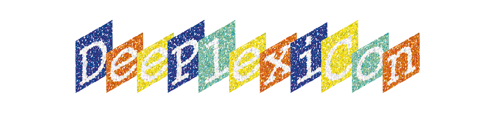
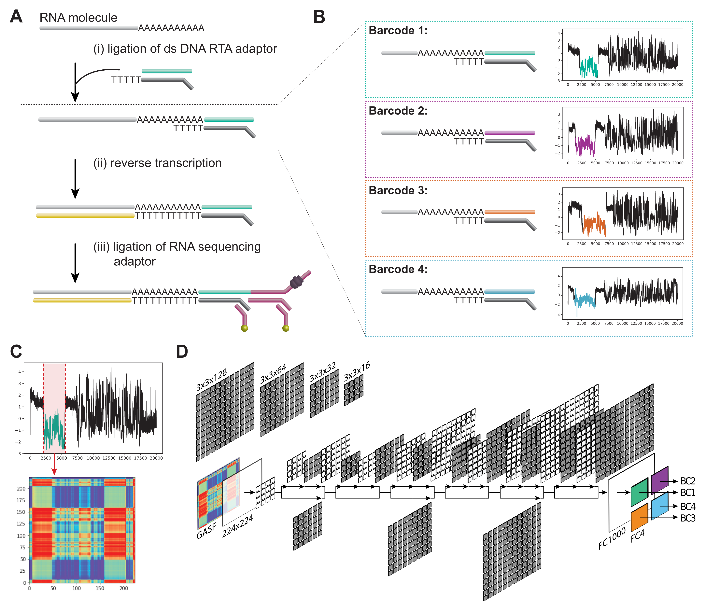

Signal-based demultiplexing of direct RNA sequencing reads using convolutional neural networks

### About DeePlexiCon
DeePlexiCon is a tool to demultiplex barcoded direct RNA sequencing reads from Oxford Nanopore Technologies.
Please note that the software has been tested and validated with a set of 4 20bp barcodes listed below:                                     

- Barcode 1: GGCTTCTTCTTGCTCTTAGG
- Barcode 2: GTGATTCTCGTCTTTCTGCG
- Barcode 3: GTACTTTTCTCTTTGCGCGG
- Barcode 4: GGTCTTCGCTCGGTCTTATT

Please see below further instructions about how to build barcoded direct RNA libraries.

## What's included
- Script to demultiplex direct RNA fast5 reads, barcoded using the strategy described above
- Example fast5 data built using the 4 custom barcoded adaptors

## Installation

### For Ubuntu 16.04
#### add python 3.6 repo (not on default 16.04 ppa repos)

    sudo add-apt-repository ppa:deadsnakes/ppa
    sudo apt-get update
    sudo apt-get install python3.6 python3.6-venv

<!-- #### TMP option: add python3.7
    sudo apt install python3.7 python3.7-dev python3.7-venv
    python3.7 -m venv ./DPC
    source ./DPC/bin/activate
    pip install Keras==2.2.4 Pandas PyTs Scikit-learn numba==0.45.0 TensorFlow==1.13.1
 -->

### Linux with python3.6
#### Create environtment

    python3.6 -m venv ./Deeplexicon/

#### clone git repository

    git clone https://github.com/Psy-Fer/deeplexicon.git

#### source and install requirements CPU
    source Deeplexicon/bin/activate
    pip3 install Keras Tensorflow Pandas PyTs Scikit-learn numba==0.45.0

#### Source and install requirements GPU

##### (Coming soon)

<!-- source Deeplexicon/bin/activate
pip3 install Keras tensorflow-gpu Pandas PyTs Scikit-learn numba==0.45.0 -->

## Running the software

    python3 deeplexicon.py -p ~/top/fast5/path/ -f multi -m model/pAmps-final-actrun_newdata_nanopore_UResNet20v2_model.030.h5 > output.tsv

Please note, the current algorithm has been trained to demultiplex the 4 barcodes shown above. It will not accurately demultiplex reads if different sequences are used.

## How to build barcoded direct RNA sequencing libraries:

To build the barcoded libraries, the oligo DNA sequences listed below should be used instead of those coming with the direct RNA sequencing kit (RTA). The barcode is embedded in the oligoA sequence, which will be ligated to the RNA molecule during the library preparation.

These oligos are designed to barcode libraries which have been enriched with oligodT beads (i.e. RNA should have polyA tail to anneal to oligoB). Each oligoA matches an oligoB.

OligoA :

- OligoA_shuffle1: 5'-/5Phos/GGCTTCTTCTTGCTCTTAGGTAGTAGGTTC-3' (same as in ONT RTA):
- OligoA_shuffle2: 5'-/5Phos/GTGATTCTCGTCTTTCTGCGTAGTAGGTTC-3'
- OligoA_shuffle3: 5'-/5Phos/GTACTTTTCTCTTTGCGCGGTAGTAGGTTC-3'
- OligoA_shuffle4: 5'-/5Phos/GGTCTTCGCTCGGTCTTATTTAGTAGGTTC-3'

OligoB:

- OligoB_shuffle1: 5’-GAGGCGAGCGGTCAATTTTCCTAAGAGCAAGAAGAAGCCTTTTTTTTTT-3’  (same as in ONT RTA)
- OligoB_shuffle2: 5’-GAGGCGAGCGGTCAATTTTCGCAGAAAGACGAGAATCACTTTTTTTTTT-3’
- OligoB_shuffle3: 5’-GAGGCGAGCGGTCAATTTTCCGCGCAAAGAGAAAAGTACTTTTTTTTTT-3’
- OligoB_shuffle4: 5’-GAGGCGAGCGGTCAATTTTAATAAGACCGAGCGAAGACCTTTTTTTTTT-3’

## Additional information:

Full library versions used:

    absl-py==0.7.1
    astor==0.8.0
    cycler==0.10.0
    gast==0.2.2
    google-pasta==0.1.7
    grpcio==1.22.0
    h5py==2.9.0
    joblib==0.13.2
    Keras==2.2.4
    Keras-Applications==1.0.8
    Keras-Preprocessing==1.1.0
    kiwisolver==1.1.0
    llvmlite==0.29.0
    Markdown==3.1.1
    matplotlib==3.1.1
    numba==0.45.0
    numpy==1.17.0
    pandas==0.25.0
    protobuf==3.9.1
    pyparsing==2.4.2
    python-dateutil==2.8.0
    pyts==0.8.0
    pytz==2019.2
    PyYAML==5.1.2
    scikit-learn==0.21.3
    scipy==1.3.1
    six==1.12.0
    tensorboard==1.14.0
    tensorflow==1.14.0
    tensorflow-estimator==1.14.0
    termcolor==1.1.0
    Werkzeug==0.15.5
    wrapt==1.11.2

## Citing this work:
If you find this work useful, please cite:

Martin A. Smith, Tansel Ersavas, James M. Ferguson, Huanle Liu, Morghan C. Lucas, Oguzhan Begik, Lilly Bojarski, Kirston Barton and Eva Maria Novoa. Barcoding and demultiplexing Oxford Nanopore direct RNA sequencing reads with deep residual learning. bioRxiv 2019
