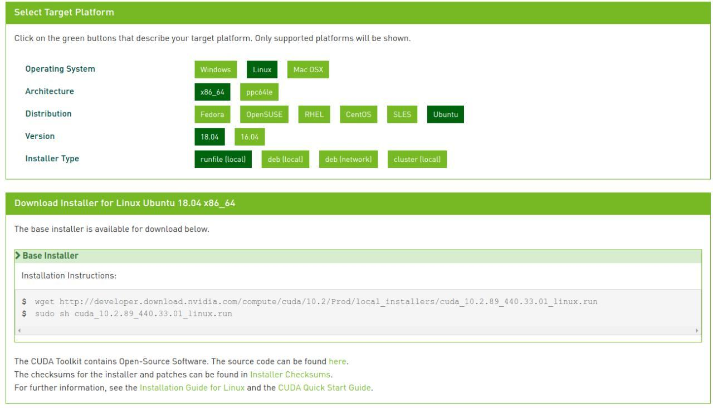

# Setting up training environmnet

Setting up your environment for training is a rather difficult task given the multitude of caveates associated with various operating systems, versions, and hardware.

This guide, is to give as clear and simple instructions as possible that should be translatable to most "current" versions of Ubuntu (16/18/20).04 LTS.

By checking compatibility and ensuring to download the appropriate files for your setup, this should be achievable without stuffing the graphics drivers too much.

**WARNING!!!**

However, on that note, I have to give the obligatory **WARNING!!!**
This is a guide only, and you are ultimately responsible for what you do to your system.
We take no responsibility for any damage or system instability caused.

**WARNING!!!**

So, first thing first...

## Requirements (recommended minimum)

- Ubuntu (18.04 LTS)
- sudo access
- RAM (16GB, more recommended)
- NVIDIA Graphics card with CUDA cores (4gb or more)
- NVIDIA drivers (440 - or something with CUDA 10.0 or higher)
- CUDA 10.0
- cuDNN 7.4.2
- tensorflow-gpu==1.13.1

## Requirements notes

Graphics cards with more memory will be able to use a larget batch size. Batch size is a measure of how many images (reads) are parsed to the GPU at a time, thus a larger batch size = faster training.

A GTX/RTX or NVIDIA card with CUDA cores (TITAN/TESLA/etc) is needed here. AMD/ATI will not work.

We have used GTX1080Ti(4gb) and TESLA V100 (16GB).

Multi-GPU is not supported with the command line interface.

Graphics drivers are backward, but not forward compatible. So when you run `nvidia-smi`, as long as "CUDA Version" is higher than 10.0, we should be fine (for now at least Q1 2020)

CUDA, cuDNN, and tensorflow are all coupled by versions.

Please use the versions mentioned unless you know what you are doing.

Refer [here](https://www.tensorflow.org/install/source#linux) for more info on version compatibility

Tensorflow 1.13.1 was used because of a backend keras issue that impacted multi-gpu training back when DeePlexiCon was being developed.

We will eventually move everything to TensorFlow 2.0 (where this has been fixed) when there is a major retraining or chemistry update.

If you get stuck in a boot loop, or can't boot the machine anymore/get black screens, boot into the GRUB bootloader, start a root shell, remove NVIDIA drivers, and re-install them. (details provided bellow)

## Install/update NVIDIA drivers

**WARNING**

This is probably the most volatile step. Please proceed with caution.

Note, here `nvidia-440` is for the driver version 440. Check compatibility [here](https://www.nvidia.com/en-us/drivers/unix/)

### Step 1

#### Method 1

    sudo add-apt-repository ppa:graphics-drivers/ppa
    sudo apt-get update
    sudo apt install nvidia-440

#### Method 2

See devices and available versions:

    sudo ubuntu-drivers devices

I see this:

    vendor   : NVIDIA Corporation
    model    : GP107M [GeForce GTX 1050 Ti Mobile]
    driver   : nvidia-driver-435 - distro non-free
    driver   : nvidia-driver-440 - third-party free recommended
    driver   : nvidia-driver-390 - distro non-free
    driver   : xserver-xorg-video-nouveau - distro free builtin

Then run

    sudo ubuntu-drivers nvidia-driver-440

### Step 2

Now reboot

### Step 3

Check the drivers installed properly

    nvidia-smi

You should see something like this

    Fri May 29 03:29:58 2020       
    +-----------------------------------------------------------------------------+
    | NVIDIA-SMI 440.64.00    Driver Version: 440.64.00    CUDA Version: 10.2     |
    |-------------------------------+----------------------+----------------------+
    | GPU  Name        Persistence-M| Bus-Id        Disp.A | Volatile Uncorr. ECC |
    | Fan  Temp  Perf  Pwr:Usage/Cap|         Memory-Usage | GPU-Util  Compute M. |
    |===============================+======================+======================|
    |   0  GeForce GTX 105...  On   | 00000000:01:00.0 Off |                  N/A |
    | N/A   45C    P8    N/A /  N/A |   1077MiB /  4040MiB |      0%      Default |
    +-------------------------------+----------------------+----------------------+

    +-----------------------------------------------------------------------------+
    | Processes:                                                       GPU Memory |
    |  GPU       PID   Type   Process name                             Usage      |
    |=============================================================================|
    |    0      1320      G   /usr/lib/xorg/Xorg                            47MiB |
    |    0      1628      G   /usr/bin/gnome-shell                          47MiB |
    |    0      2702      G   /usr/lib/xorg/Xorg                           299MiB |
    |    0      2873      G   /usr/bin/gnome-shell                         214MiB |
    +-----------------------------------------------------------------------------+

#### If you are getting a boot loop or black screen/crashes after reboot

Get into the GRUB bootloader. See [here](https://askubuntu.com/questions/16042/how-to-get-to-the-grub-menu-at-boot-time) for a few ways to do that.

Drop into a root shell with internet access. You can do this in the advanced options. See [here](https://askubuntu.com/questions/92556/how-do-i-boot-into-a-root-shell) for more info

Remove all nvidia packages

    sudo apt-get purge nvidia*

Ensure the ppa is added and update package list

    sudo add-apt-repository ppa:graphics-drivers
    sudo apt-get update

Install latest driver

    sudo apt-get install nvidia-440

Another way is to read [this](https://www.linuxbabe.com/ubuntu/install-nvidia-driver-ubuntu-18-04) and use the latest drivers.

    sudo ubuntu-drivers devices
    sudo ubuntu-drivers nvidia-driver-440

## Installing CUDA 10.0

Now the hard part is over, we will install CUDA

Download the `runfile (local)` from [here](https://developer.nvidia.com/cuda-downloads)

Something like this:

**under development**

Source of inspiration for this guide, that helped me a lot.

[Install CUDA 10.0 and cuDNN v7.4.2 on Ubuntu 16.04](https://gist.github.com/matheustguimaraes/43e0b65aa534db4df2918f835b9b361d)
